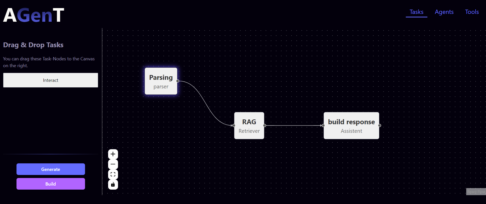

# AGent UI

AGent is a no-code/low-code platform that allows users to create, manage, and visualize agent-based workflows effortlessly. you can drag and drop components to define agents, tools, tasks, and their relationships, all while visualizing your workflow in an interactive diagram.

- **AGent framework**: AGent is a framework i built for creating agent-based workflows. It abstracts the complexity of agent-based systems and provides a simple, intuitive interface for defining agents, tools, tasks, and relationships.
you can check the AGent framework [here](https://github.com/omertait/AgenT).

- **UI live demo**: you can check the live demo of the AGent UI [here](https://omertait.github.io/AGent-Frontend).

## Features

### 🌟 Graph Visualization
- **Define agents, tools, tasks, and relationships visually**: Turn abstract concepts into clear, actionable insights and boost your productivity. 
- **Simplify complex workflows**: Instantly understand relationships and operations through intuitive graphs that enhance both clarity and efficiency.

### 🛠️ No-Code/Low-Code Platform
- **Minimal coding required**: Whether you’re an experienced developer or non-technical, AGent empowers you to create and adjust workflows with ease.
- **Flexible and fast**: Innovate rapidly, and unleash your creativity without being bogged down by traditional coding processes.

### 🔄 Customizable Workflows
- **Tailor workflows to your needs**: AGent adapts to your specific requirements. Modify and personalize workflows effortlessly, ensuring they align with your objectives.
- **Versatility and scalability**: Use the platform’s flexibility to scale your operations and integrate advanced AI agents into your workflows.

### 🤖 AI-Powered Workflow Generation
- **Generate workflows with natural language**: Describe what you want to achieve in a prompt, and let the AI generate the corresponding workflow for you.
- **Leverage advanced language models**: Utilize the power of large language models (LLMs) to translate your descriptions into actionable workflows, saving time and effort.
- **Enhance productivity**: Quickly create complex workflows without needing to manually define each component, allowing you to focus on higher-level planning and strategy.
> [!NOTE]  
> In the demo version, the AI-Powered Workflow Generation is not enabled. 
> Instead, it loads prebuilt examples. To see it in action, simply hit the Generate button on the Dashboard.

## Installation

To run this project locally, follow these steps:

1. Clone the repository: `git clone https://github.com/omertait/AGent-Frontend`
2. Install dependencies: `npm install`
3. Start the development server: `npm run dev`
4. Open your browser and visit `http://127.0.0.1:5173/`

## Usage Documentation
check out the documentation of the AGent UI [here](https://github.com/omertait/AGent-Frontend/Doucmentation.md).

## Work in Progress
Note that this project is still in development, and there are many features and improvements that i'm planning to add in the future.

